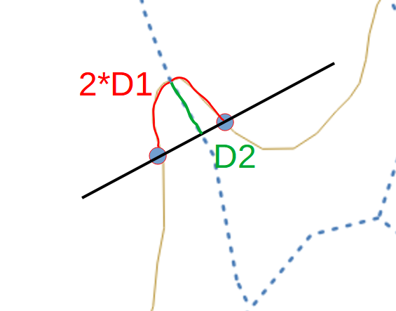

# Ferramentas experimentais

Conjunto de ferramentas experimentais para verificar a aplicabilidade na produção de geoinformação.

Algumas ferramentas estão disponibilizadas como *processing*, acessadas através da aba da **Caixa de Ferramentas de processamento** no QGIS.

Outras funções estão na forma de botões na barra de ferramentas do QGIS.

## Processings
### 1- Remover Camadas Vazias
Remove as camadas sem feições no QGIS.

### 2- Atribuir SRC
Permite que o usuário atribua um SRC a camadas. Também é possivel atribuir o SRC para somente camadas com o sistema inválido.

### 3- Exportar para *Shapefile* no padrão MGCP (passado para o ferramentas MGCP)

### 4- Ordenar Trecho de Drenagem
Tem como parâmetro de entrada uma camada vetorial com geometria do tipo linha, com linhas já direcionadas e retorna uma cópia da camada com o campo "ordem" na tabela de atributos. A ordem é calculada da seguinte maneira: atribui-se 1 às linhas com conexão a apenas uma outra linha e para as outras linhas desconhecidas atribui-se a maior "ordem + 1" de outra linha conectada ao primeiro ponto dessa.

*É necessário que a camada do trecho de drenagem esteja direcionado.*

### 5 - Consistência entre Trecho de Drenagem e Curva de Nível
Os parâmetros são: uma camada vetorial com geometria do tipo linha trecho de drenagem, o campo da tabela de atributos dessa camada correspondente a uma chave primária (campo que identifica a linha), camada vetorial com geometria do tipo linha contendo as curvas de nível, o campo da tabela de atributos dessa camada correspondente ao valor das cotas, e o valor da equidistância entre as cotas. 

O *processing* detecta inconsistências na camada de drenagem em relação a camada contendo as curvas de nível. Se alguma inconsistência for detectada é gerada uma camada de pontos como saída apontando o local das inconsistências. Essa camada é gerada de "ordem" em "ordem" (de acordo com o calculado pelo *processing* **Ordenar Fluxo**), se, numa determinada ordem, for detectada inconsistência, o programa para, deixando de seguir para a procura na ordem seguinte e gera a camada de saída. Se não houver nenhuma inconsistência, retorna-se a mensagem "nenhuma inconsistência verificada" na janela de execução do *processing* como *feedback*.

No QGIS 3.16.4 no caso de uma curva de nível cujo vértice toca (usando *snap*) em apenas um vértice de uma drenagem, o *processing* nativo de interseção (que é o método usado para identificar as interseções entre a curva de nível e a drenagem) retorna 2 pontos com a mesma cota (cota da curva de nível que tocou a drenagem em um vértice), fazendo com o que o *processing* gere a camada de saída incluindo esses pontos como inconsistência (2 pontos com mesma cota em uma mesma linha de drenagem).

*É necessário que a camada do trecho de drenagem esteja direcionado.*

### 6 - Identificar Geometria Inválida
Tem como parâmetro camadas vetorias e *string* contendo o nome do campo contendo chave primária (padrão = id), ao ser executado retorna, no log, o campo primário das feições que possuem geometria invalida e suas respectivas camadas. Verifica-se se a feição apresenta:
- Geometria diferente de MultiPoint, MultiLineString ou MultiPolygon
- Geometria nula ou vazia
- Outros casos de geometria inválida, poligonos que não fecham, linhas com apenas 1 ponto, polígonos com menos de 3 pontos, etc

### 7 - Identificar fundo de vale incorreto
Parâmetros necessários:
- Camada de curva de nível
- Camada de trecho de drenagem
- Tamanho do segmento sobre a linha (D1): Distância partir do ponto de interseçào entre uma curva e uma drenagem, sobre a curva de nível
- Tolerância para a projeçã0 do ponto (D2): Distância máxima entre a interseção (curva de nível vs trecho de drenagem) e o segmento gerado pelos extremos do arco do item anterior
A figura a seguir descreve as medidas D1 e D2 tomadas como parâmetro no algoritmo.

  

*É necessário que a camada do trecho de drenagem esteja direcionado.*

### 8 - Identificar Geometria com Multiplas Partes
Recebe uma lista de camadas e verifica se alguma feição tem geometria contendo mais de uma parte, por exemplo, uma camada de pontos com uma feição cuja geometria é mais de um ponto. Retorna camadas de inconsistência para cada tipo de geometria, se não for encontrada nenhuma inconsistência de um determinado tipo de geometria, não haverá retorno daquele tipo de geometria.

### 9 - Identificar *Holes* Menores que Tolerância
Recebe camada de poligonos e um valor para tolerância, retorna camada de polígonos dos *holes* com área menor que a tolerância determinada.

### 10 - Identificar Feições Menores que Tolerância
Recebe uma lista de camadas vetoriais, uma tabela CSV contendo duas colunas: nome (da camada), tamanho (mínimo das feições), nessa ordem, necessariamente, e uma camada do tipo polígono contendo a moldura. Verifica-se então quais feições são menores que o tamanho determinado para cada camada e retorna-se aquelas que estão completamente dentro das molduras.

### 11 - Identificar Linhas Soltas Menores que Tolerância
Recebe uma lista de camadas vetoriais (linhas), uma tabela CSV contendo duas colunas: nome (da camada), tamanho (mínimo das feições), nessa ordem, necessariamente, e uma camada do tipo polígono contendo a moldura. Verifica-se então quais linhas soltas são menores que o tamanho determinado para cada camada e retorna-se aquelas que estão completamente dentro das molduras.

### 12 - Identificar Linhas Próximas à Moldura
Recebe uma lista de camadas vetoriais (linhas), um número indicando o valor máximo para a distância da linha à borda, e uma camada do tipo polígono contendo a moldura. Verifica-se então quais linhas soltas estão a uma distância menor do que a especificada da borda e retorna-se aquelas que estão completamente dentro das molduras.

### 13 - Identificar mudança de atributos em linhas
Recebe uma camada vetorial do tipo linha, os campos a serem verificados e um valor de tolerância para desvio da linha. Verifica-se se houve mudança no valor dos campos a serem verificados entre duas linhas cujo ângulo entre elas diferencie, no máximo, do valor de tolerância em relação a 180 graus. Por exemplo, se o valor de tolerância for 10, apenas linhas cujo menor angulo entre elas esteja no intervalo de (170,180) terão os campos comparados.

### 14 - Identificar conexão entre molduras
Vefifica a conexão de geometrias em áreas próximas às molduras indicadas. A rotina verificará a conexão dos vértices muito próximos das molduras, além da conformidade de atributos entre as feições conectadas próximas dos limites da moldura.
Parâmetros necessários:
- Camada de molduras : todas as feições da camada ou seleção feita pelo usuário
- Camadas a serem verificadas: camadas do tipo linha ou área que serão analisadas
- Atributos a serem ignorados: separados por ";", define quais atributos serão ignorados na comparação de atributos entre feições conectadas
- Tolerância: apenas feições próximas das interseções entre molduras (definido por esse parâmetro)serão analisadas 

### 15 - Remover __Holes__ menores que tolerância
Verifica holes menores que a tolerância e os remove. As modificações não são salvas: caso o usuário queira confirmar as mudanças, deverá salvar a camada manualmente.
Parâmetros:
- Camada
- Tolerância: remove __holes__ cuja áreas são maiores que a tolerância

### 16 - Verificador ortográfico

Recebe como entrada múltiplas camadas e um nome de atributo. Cria uma coluna temporária com os erros ortográficos encontrados naquele atributo.

*As camadas devem estar com a edição ativa para a criação da coluna temporária*

### 17 - Carrega shapefiles

Carrega uma pasta com shapefiles de forma organizada.

### 18 - Verifica UUID

Recebe como entrada múltiplas camadas e um nome de atributo. Encontra erros de UUID duplicado e de UUID inválido. Também possui a opção de corrigir os erros encontrados.

### 19 - Atributar fundos de vale
Similar à ferramente 4- Corta início da linha, mas é realizada na extensão da camada. Utiliza a ferramenta __Identify Dangles__ do DSGTools para identificar as pontas livres e corta/atributa a feição de acordo com os parâmetros fornecidos pelo usuário.
Atualmente a ferramenta modifica o atributo 'tipo' para o valor 3 nas feições cortadas.
Parâmetros necessários:
- Camada de molduras
- Camada a ser processada (trecho de drenagem)
- Camada do corpo d'água
- Distância de corte: Em quantos metros a feição será cortada, baseado em seu início.
- Distância máxima entre vértices e molduras: Caso a distância entre o vértice inicial da feição e a moldura/corpo d'água seja menor que esse parâmetro, a feição será ignorada

### 20 - Identifica Imutabilidade de Atributo em Poligonos Vizinhos
Retorna uma camada com polígonos, menores que a área definida pelo usuário, que tem o mesmo valor que polígonos vizinhos em todos atributos selecionados.
Parâmetros:
- Camada de polígono
- Campos: atributos que serão verificados
- Área máxima: polígonos maiores ou iguais a essa área não serão retornados

### 21 - Identifica Linhas Seccionadas sem Motivo
Retorna camada pontos onde há interseção entre extremidades de apenas 2 linhas sem mudança de atributos. Pontos que intersectam vértices da moldura não serão retornados.
Parâmetros:
- Múltiplas camadas de linha
- Campos: atributos que **não** serão verificados
- Camada de polígono: moldura. 

### 22 - Snap de linhas na moldura
Realiza o snap na moldura de múltiplas camadas de linha. Também cria vértices na moldura no ponto de interseção.

### 23 - Clipa camadas com a moldura
Clipa multiplas camadas de linha e área com a moldura. As molduras são dissolvidas antes do processamento.

### 24 - Corrige interseções sem vértice em comum
Tem como entrada múltiplas camada de linha. O algoritmo cria um vertice em comum quando necessário para ambas as linhas na interseção entre elas.

### 25 - Identifica overlaps
Tem como entrada múltiplas camada de linha e múltiplas camadas de polígono. O algoritmo cria flag de overlaps entre camadas de mesma geometria.

### 26 - Snap entre linhas
Tem como entrada múltiplas camada de linha e uma distância. Realiza o snap entre linhas criando vértices na feição destino se necessário.

### 27- Identifica interseções menores que ângulo mínimo
Verifica se segmentos consecutivos formam ângulos pequenos. É capaz de analisar camadas de maneira individual (tipo linha ou área) ou entre camadas (tipo linha).
Parâmetros:
- Camada(s) do tipo linha
- Camada(s) do tipo área
- Ângulo mínimo: segmentos que geram ângulos menores que o ângulo mínimo serão reportadas

### 28 - Identifica Poligonos Vizinhos Pequenos sem Mudança de Atributos
Retorna uma camada com polígonos, menores que a área definida pelo usuário em uma tabela CSV (Colunas: nome da camada, tamanho), que tem o mesmo valor que polígonos vizinhos em todos atributos exceto os especificados como entrada. Leva-se em consideração uma moldura (dissolvida, ou seja, considera-se apenas os limites exteriores da moldura).
Parâmetros:
- Camada de polígono
- Tabela CSV
- Camada de moldura
- Texto: atributos que **não** serão verificados

### 29 - Snap de poligonos na moldura
Realiza o snap na moldura de múltiplas camadas de poligono. Também cria vértices na moldura no ponto de interseção.

### 30 - Converte linhas conectadas para multilinha

### 31 - Conectar pontas soltas entre linhas

### 32 - Conectar áreas e linhas

### 33 - Remover pontos

### 34 - Verificar geometrias próximas

### 35 - Remove vértices duplicados

### 36 - Verifica Hidrografia
Verifica condições lógico espaciais envolvendo elementos de camadas de hidrografia (parâmetros).
Parâmetros:
- Camada de drenagem (linha)
- Camada de barragens (linha)
- Camada de barragens (polígono)
- Camada de massa d'água (polígono)
- Camada de vertedouro/sumidouro (ponto)
- Camada de elemento hidrográfico (ponto)
- Camada de elemento hidrográfico (linha)
- Camada de elemento hidrográfico (polígono)
- Camada de moldura (polígono)

### 37 - Verifica Empilhamento de Curvas de Nível
Compara valores de cota entre curvas de nível fechadas interna a outra, de acordo com o valor de equidistância e tipo (normal ou depressão)
Parâmetros:
- Camada de curva de nível (linha)
- Campo correspondente a cota
- Campo correspondente a tipo
- Valor da equidistância entre as cotas

### 38 - Consistência entre Massa d'água(Polígono) e Curva de Nível
Detecta inconsistências lógicas entre  massas d'água e curvas de nível. Também verifica se, uma vez que a curva cruza a massa d'água, toca em algum trecho de drenagem do tipo *Dentro de polígono*.
Parâmetros:
- Camada de massa d'água (polígono)
- Camada de trechos de drenagem (linha)
- Camada de curvas de nível (linha)
- Campo contendo as cotas das curvas de nível

### 39 - Verifica Transporte
Verifica inconsistências lógicas em elementos viários (bueiro, ponte, vau) e barragem, quando comparados a camadas de vias de deslocamento e drenagem.
Parâmetros:
- Camada de drenagem (linha)
- Camada de elementos viários (ponto)
- Camada de elementos viários (linha)
- Camada de vias de deslocamento (linha)
- Camada de barragens (linha)

### 40 - Identifica Múltiplas Interseções Entre Curva de Nível e Drenagem
Retorna as interseções entre uma drenagem e uma curva de nível que se intersectam mais de uma vez (qualquer interseção não vazia diferente de apenas 1 ponto).
Parâmetros:
- Camada de drenagem (linha)
- Camada de curva de nível (linha)

### 41 - Identifica Feições Próximas
Retorna feições cuja distância entre si é menor que o definido na tabela CSV para cada camada, no caso de 2 camadas de linha, também é definda a tolerância, que é o tamanho total de uma linha que está contida no *buffer* de outra linha.
Parâmetros:
- Tabela CSV
- Tolerância

### 42 - Generalização de Ponto Cotado
Retorna apenas os pontos cotados mantidos de acordo com o critério.
Critério:
- Em cada quadricula serão mantidos os pontos cotados nas curvas de nivel mais internas. Se há mais de um ponto na mesma curva de nivel mais interna, usa-se o ponto de maior altitude nas curvas normais e os pontos de menores altitudes nas curvas de depressão. 
- Se não há ponto cotado nas curvas de nível mais internas, mantém-se apenas o ponto de menor cota da quadricula.

Parâmetros:
- Escala
- Camada dos pontos cotados
- Camada das curvas de nível
- Campo indicando se a curva é depressão ou normal

### 43 - Mescla Linhas pelo Tamanho
Retorna camada com as linhas mescladas com base no tamanho. Em caso de bifurcação, percorre-se o caminho de maior tamanho para mesclar. Considera-se o sentido das linhas para conectar, ou seja, o início de uma linha só pode conectar-se ao final de outra, assim como o final de uma linha só pode ser conectado ao início de outra linha, nunca ao final de alguma. Linhas menores que a tolerância não serão mescladas.

Parâmetros:
- Camada de linhas
- Tolerância (inteiro)
- Iterações (inteiro)

### 44 - Verificar Geometria da Rede
Retorna inconsistências na geometria da rede. Os campos selecionados são analisados para verificar linhas que deveriam estar mergeadas por possuir atributos iguais.

Parâmetros:
- Camada de linhas (rede)
- Campos

## Modelos
### 1 - Gera centroide de área edificada

Gera centroides de área construída baseado nos delimitadores.

### 2 - Valida Centroides

Substituto temporário do processing de construir áreas a partir de delimitador e centroide do DSGTools.

### 3 - Ponta livre entre camadas

Tem como entrada múltiplas camadas de linha e o raio de busca. Procura pontas livre considerando todas as camadas simultâneamente.

### 4 - Extrai holes de Polígonos

Tem como entrada a camada polígono. O model dissolve os polígonos e extrai os holes para inspeção.

### 5 - Sliver Polygon

Retorna os poligonos com razão entre área e perímetro menor que a tolerância.

### 6 - Verifica duplicados em lote

Verifica geometria duplicada na própria camada de todas as camadas ativas no projeto.

### 7 - Verifica geometria inválida em lote

Verifica geometrias inválidas de todas as camadas ativas no projeto.

### 8 - Verifica vértices

Verifica ângulo menor que a tolerância (10 graus), vertex near edge, unshared vertex on intersections, unshared vertex on shared edges de todas as camadas ativas no projeto.

## Ferramentas
### 1- Calcula Azimute
Cria um campo na tabela de atributos da camada ativa, como armazenamento auxiliar, indicando o ângulo, no sentido horário, entre o norte e a direção da feição (considerando a *Oriented Minimum Bounding Box* da feição), recebe como entrada apenas camadas de linhas ou de polígonos.

O propósito original dessa ferramenta é calcular o azimute de pistas de pouso no padrão do MGCP.

### 2- Copia WKT 
Copia, para a área de transferência, a geometria das feições selecionadas em WKT. O usuário escolher em qual sistema de coordenadas a geometria das feições serão copiadas.

### 3- Copia-Cola Geometria
Botão Copiar Geometria: copia, para uma variável interna do QGIS, a geometria da feição selecionada. Botão Colar Geometria:  substitui a geometria da feição selecionada de acordo com a geometria armazenada na variável interna. A geometria só é substituída se a camada da geometria de origem for do mesmo tipo geométrico da camada de destino. Copia e substitui apenas uma feição por vez.

### 4- Corta início da linha
Dado um ou mais linhas selecionadas, a ferramenta corta o ínicio do linha em uma distância configurável.

### 5- Filtro espacial
Permite o usuário desenhar um poligono, e aplicar esse poligono como filtro espacial nas camadas.

### 6- Repetir atributação da feição

### 7- Filtra camada pelas feições selecionadas

### 8- Copia feições para camada Temporária
Cria nova camada temporaria 'camada_nome_temp' com as feições selecionadas de 'camada_nome'.

### 9- Filtra todas as camadas pelos poligonos selecionados

### 10- Remove o filtro de todas as camadas

## Processings de edição

### 1- Salvar máscaras (passado para o plugin de edição)

### 2- Carrega máscaras (passado para o plugin de edição)

### 3- Definir cota mais alta por moldura (passado para o plugin de edição)

### 4- Definir largura ponte e bueiro

### 5- Definir largura simbolo de barragem

### 6- Definir rotação de edificações

### 7- Definir rotação de corredeira e queda dágua

### 8- Definir rotação de ponte e bueiro

### 9 - Generaliza edificações

### 10 - Mescla rios (passado para o plugin de edição)

### 11 - Ordenar camadas de edição (passado para o plugin de edição)

### 12 - Exporta estilos para arquivo QML (passado para o plugin de edição)

### 13 - Definir campo texto_edicao

### 14 - Prepara Carta Mini
Cria uma cópia das feições com carta_mini = **false**, modificando outros atributos a depender da camada. Nas feições do tipo linha, a cópia tem apenas o ponto inicial e final. Da camada de polígono extrai-se uma cópia do centroide,preenche-se atributos dessa cópia e adiciona à camada edicao_texto_generico_p.
Parâmetros:
- identificador_trecho_rod_p (ponto)
- llp_localidade_p (ponto)
- edicao_simb_hidrografia_p (ponto)
- edicao_simb_hidrografia_l (linha)
- elemnat_toponimo_fisiografico_natural_p (ponto)
- elemnat_toponimo_fisiografico_natural_l (linha)
- edicao_texto_generico_p (ponto)
- edicao_texto_generico_l (linha)
- llp_limite_especial_a (polígono)

### 15 - Prepara carta ortoimagem (passado para o plugin de edição)
